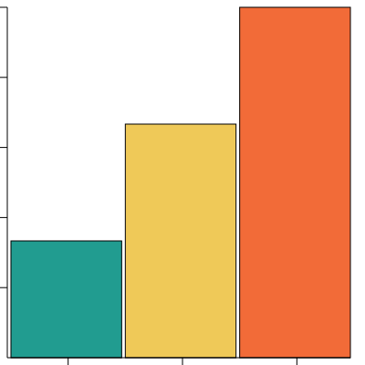

# SimpleCharts
A tool to generate simple charts in svg, out of custom datasets. 

# How it works!

SimpleCharts generates a set of methods for creating pie-, bar-, doughnut- and linecharts in svg with custom data. The data is sent in the form of an array of objects. It is also possible to include a set of options for style. The components of the charts are made up of individual svg elements. This makes it possible to target them separately for styling or such.

The chart have hover effects displaying information depending on chart type. This feature only works in the browser, not on github. Feel free to try the charts in your browser.

# Get started! 

1. Import SimpleCharts into your project from the path of the module:

Example:

```
    import { SimpleCharts } from 'path'
```

1. Set up your dataset (required) and configurations (optional):

Example:

```
    const dataset = [
      {argument: 'One', value: 2, color: '#32CD32'},
      {argument: 'Two', value: 4, color: '#A9A9A9'},
      {argument: 'Three', value: 1, color: '#A52A2A'}
    ]
```

3. Create and instance of SimpleCharts:

Example:

```
    const simpleCharts = new SimpleCharts(dataset)
```

   Now you are good to go!

# Data
The input data is provided as an array of objects, where each object represent a datapoint. The key-value pairs are: 

| Key | Value |
| -------- | ------- |
| argument |  A string, represent the name of the datapoint |
| value | A positive integer (with or without decimals), represent the value of the datapoint |
| color    | A string representing a hexadecimal color, this is the color of the datapoint in the visualization |''

Example:

```
[
  {argument: 'One', value: 2, color: '#32CD32'},
  {argument: 'Two', value: 4, color: '#A9A9A9'},
  {argument: 'Three', value: 1, color: '#A52A2A'}
]
```

# Configuration

The configuration is provided as an object of objects, included with SimpleCharts constructor. To include these are optional and all of them have a default value. 

## Size

**size** object defines the dimensions of the svg with properties height and width.
Height and width are both positive integers.
| Key | Value |
| -------- | ------- |
| **width** | A positive number, represent the width of the svg|
|| **Default value:** 400 |
| **height** | A positive integer, represent the height of the svg |
|| **Default value:** 400 |

Example:

```
const dataset = [
  {argument: 'One', value: 2, color: '#32CD32'},
  {argument: 'Two', value: 4, color: '#A9A9A9'},
  {argument: 'Three', value: 1, color: '#A52A2A'}
]

const chartOptions = {
  size: {
    width: 400,
    height: 400
  }
}

const simpleCharts = new SimpleCharts(dataset, chartOptions)

```

## yAxis

**yAxis** object with options for the y-axis used with line chart, and bar chart.

| Key | Value |
| -------- | ------- |
| **ticks** | A positive number, represent the number of ticks (markings) on the y-axis |
|| **Default value:** 5 |
|| **Max value:** 20 |
| **maxValue** | A positive number, represent the maximum value of the y-axis |
|| **Default value:** The highest value in the dataset |
|| **Minimum value:** The highest value in the dataset |

Example:

```
const dataset = [
  {argument: 'One', value: 2, color: '#32CD32'},
  {argument: 'Two', value: 4, color: '#A9A9A9'},
  {argument: 'Three', value: 1, color: '#A52A2A'}
]

const chartOptions = {
  yAxis: {
    ticks: 5,
    maxValue: 10
  }
}

const simpleCharts = new SimpleCharts(dataset, chartOptions)

```

## xAxis

**xAxis** object with options for the x-axis used with line chart.

| Key | Value |
| -------- | ------- |
| **tickValues** | A array of strings, represent the number of ticks (markings) on the x-axis |
|| Displayed from the left of x-axis and onwards |
|| String values displayed on hover on corresponding tick |
|| **Default value:** [] |
|| **Maximum length:** 50 |

Example:
  
```
const dataset = [
  {argument: 'One', value: 2, color: '#32CD32'},
  {argument: 'Two', value: 4, color: '#A9A9A9'},
  {argument: 'Three', value: 1, color: '#A52A2A'}
]

const chartOptions = {
  xAxis: {
    tickValues: ['One', 'Two', 'Three']
  }
}

const simpleCharts = new SimpleCharts(dataset, chartOptions)
```

# Usage

The different kinds of charts are generated using a corresponding method of SimpleCharts, which return the genereated svg-element.

## Pie chart

**A pie chart is genereated and returned by plotPieChart()**

Example:
```
const dataSet = [
  {argument: 'One', value: 1, color: '#219C90'},
  {argument: 'Two', value: 2, color: '#EFC958'},
  {argument: 'Three', value: 3, color: '#F26B38'}
]

const simpleCharts = new SimpleCharts(dataSet)
const pieChart = simpleCharts.pieChart()
```
**Each slice of the pie display on hover the corresponding datapoints argument, value and percent of the total dataset value rounded to two decimals.**



## Bar chart

**A bar chart is genereated and returned by plotBarChart()**

Example:
```
const dataSet = [
  {argument: 'One', value: 1, color: '#219C90'},
  {argument: 'Two', value: 2, color: '#EFC958'},
  {argument: 'Three', value: 3, color: '#F26B38'}
]

const simpleCharts = new SimpleCharts(dataSet)
const barChart = simpleCharts.barChart()
```

**Each bar display on hover the corresponding datapoints argument and value.**


## Doughnut chart

**A doughnut chart is genereated and returned by plotDoughnutChart()**

Example:
```

const dataSet = [
  {argument: 'One', value: 2, color: '#219C90'},
  {argument: 'Two', value: 3, color: '#EFC958'},
  {argument: 'Three', value: 4, color: '#F26B38'}
]

const simpleCharts = new SimpleCharts(dataSet)

const doughnutChart = simpleCharts.doughnutChart()
```

**Each slice of the doughnut display on hover the corresponding datapoints argument, value and percent of the total dataset value rounded to two decimals.**


## Line chart

**A line chart is genereated and returned by plotLineChart()**

Example:
```

const dataSet = [
  {argument: 'One', value: 2, color: '#219C90'},
  {argument: 'Two', value: 3, color: '#EFC958'},
  {argument: 'Three', value: 4, color: '#F26B38'}
]

const simpleCharts = new SimpleCharts(dataSet)

const lineChart = simpleCharts.lineChart()
```


## Edit options

It is possible to edit the options of the chart after it has been generated. This is done by calling the method editOptions() on the chart object. The method takes an object as argument, with the same structure as the options object passed to the constructor. Only pass the options you want to change. 


Example:
```
const dataSet = [
  {argument: 'One', value: 2, color: '#219C90'},
  {argument: 'Two', value: 3, color: '#EFC958'}
]


const simpleCharts = new SimpleCharts(dataSet)

lineChart.editOptions({
  size: {
    width: 500,
    height: 600
  }
}
)

const lineChart = simpleCharts.lineChart()
```


# Exceptions

SimpleCharts throws exceptions in several cases. The exceptions are thrown as Error objects with a message describing the error.

**Make sure to catch and handle the exceptions.**


# Additional information

Due to the fact that the charts are made up of individual svg elements, it is possible to target them separately for styling or such.

**DISCALIMER:** Gitlab does not support svg in markdown, so the images are not displayed directly. The title element of the svg is not displayed properly either. Therefore the hover function is not displayed in the images. Try the charts in your browser to see the hover function.


