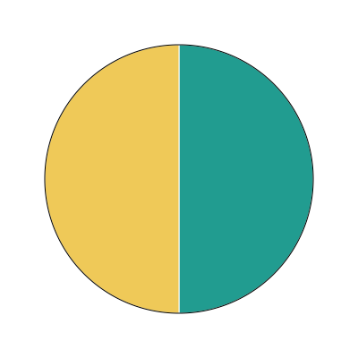

# Testrapport

This project were tested using manual test cases where input and output were recorded in this report.
Date: 2023-09-27

# Case 1, Instantiate SimpleCharts with datasets.

## 1.1 Instantiation with improper dataset (argument)

Make sure class SimpleCharts can not be instantiated with improper datasets.

### 1.1.1 Instantiation with no dataset

When instantiated without dataset, simplecharts should throw an error with message.

input: 

```
const simpleCharts = new SimpleCharts()
```

output: 

```
Error: "SimpleCharts: no dataset"
```

### 1.1.2 Instantiation with dataset of other type than arrray

When instantiated with other type than array as dataset, simplecharts should throw an error with message.

input: 

```
const dataSet = 1

const simpleCharts = new SimpleCharts(dataSet)
```

output: 

```
Error: "SimpleCharts: dataset formatting error"
```

### 1.1.3 Instantiation with dataset of empty array

When instantiated with empty array as dataset, simplecharts should throw an error with message.

input: 

```
const dataSet = []

const simpleCharts = new SimpleCharts(dataSet)
```

output: 

```
Error: "SimpleCharts: dataset formatting error"
```
### 1.1.4 Instantiation with empty datapoint

When instantiated with empty datapoint, simplecharts should throw an error with message.

input: 

```
const dataSet = [
  {}
]

const simpleCharts = new SimpleCharts(dataSet)
```

output: 

```
Error: "SimpleCharts: datapoint value has to be a positive number"
```
### 1.1.5 Instantiation with single datapoint

When instantiated with single datapoint, simplecharts should throw an error with message.

input: 

```
const dataSet = [
  {argument: 'One', value: 1, color: '#219C90'}
]

const simpleCharts = new SimpleCharts(dataSet)
```

output: 

```
Error: "SimpleCharts: dataset requires at least two datapoints"
```

### 1.1.6 Instantiation with datapoint without argument key

When instantiated with datapoint missing argument key, simplecharts should throw an error with message.

input: 

```
const dataSet = [
  {value: 1, color: '#219C90'}
]

const simpleCharts = new SimpleCharts(dataSet)
```

output: 

```
Error: "SimpleCharts: datapoint argument required and has to be a string"
```
### 1.1.7 Instantiation with datapoint where argument value is not type string
When instantiated with datapoint argument value of other type than string, simplecharts should throw an error with message.

input: 

```
const dataSet = [
  {argument: 1, value: 1, color: '#219C90'}
]

const simpleCharts = new SimpleCharts(dataSet)
```

output: 

```
Error: "SimpleCharts: datapoint argument required and has to be a string"
```

### 1.1.8 Instantiation with datapoint without value key

When instantiated with datapoint missing value key, simplecharts should throw an error with message.

input: 

```
const dataSet = [
  {argument: 'one', color: '#219C90'}
]

const simpleCharts = new SimpleCharts(dataSet)
```

output: 

```
Error: "SimpleCharts: datapoint value required and has to be a positive number"
```
### 1.1.9 Instantiation with datapoint where value is not type number
When instantiated with datapoint value of other type than string, simplecharts should throw an error with message.

input: 

```
const dataSet = [
  {argument: 'one', value: [], color: '#219C90'}
]

const simpleCharts = new SimpleCharts(dataSet)
```

output: 

```
Error: "SimpleCharts: datapoint value required and has to be a positive number"
```
### 1.1.10 Instantiation with datapoint without color key

When instantiated with datapoint missing color key, simplecharts should throw an error with message.

input: 

```
const dataSet = [
  {argument: 'one', value: 1}
]

const simpleCharts = new SimpleCharts(dataSet)
```

output: 

```
Error: "SimpleCharts: datapoint color required and has to be a string in hex color format"
```
### 1.1.11 Instantiation with datapoint where color value is not type string
When instantiated with datapoint color value of other type than string, simplecharts should throw an error with message.

input: 

```
const dataSet = [
  {argument: 'one', value: [], color: 1}
]

const simpleCharts = new SimpleCharts(dataSet)
```

output: 

```
Error: "SimpleCharts: datapoint color required and has to be a string in hex color format"
```
### 1.1.12 Instantiation with datapoint where color value is string but not in hex color format
When instantiated with datapoint color value of type string but not in hex format, simplecharts should throw an error with message.

input: 

```
const dataSet = [
  {argument: 'One', value: 1, color: 'blue'}
]

const simpleCharts = new SimpleCharts(dataSet)
```

output: 

```
Error: "SimpleCharts: datapoint color required and has to be a string in hex color format"
```
## 1.2 Instantiation with proper dataset

Make sure class SimpleCharts can not be instantiated with improper datasets.

### 1.2.1 Instantiation with dataset formatted according to ducumentation. Contains two datapoints.
When instantiated with properly formatted dataset no error is thrown and an instace of object is created.

input: 

```
const dataSet = [
  {argument: 'One', value: 2, color: '#219C90'},
  {argument: 'Two', value: 2, color: '#EFC958'}
]

const simpleCharts = new SimpleCharts(dataSet)
```

output: 

simpleCharts instantiated, no errors thrown.

```
typeof dataSet
```
return 'object'

### 1.2.2 Instantiation with dataset formatted according to ducumentation. Contains several datapoints.
When instantiated with properly formatted dataset no error is thrown and an instace of object is created.

input: 

```
const dataSet = [
  {argument: 'One', value: 2, color: '#219C90'},
  {argument: 'Two', value: 2, color: '#EFC958'},
  {argument: 'Three', value: 3, color: '#F26B38'},
  {argument: 'Four', value: 4, color: '#F26B38'},
  {argument: 'Five', value: 5, color: '#F26B38'},
  {argument: 'Six', value: 6, color: '#F26B38'},
  {argument: 'Seven', value: 7, color: '#F26B38'}
]

const simpleCharts = new SimpleCharts(dataSet)
```

output: 

simpleCharts instantiated, no errors thrown.

```
typeof dataSet
```
returns 'object'

***

## 1.3 Instantiation of simpleCharts with improper size options

Make sure simpleCharts can not be instantiated with improper size options. The size option key has to be an object with keys height and width. The value of these has to be positive numbers.

### 1.3.1 Instantiation of simpleCharts with size key value as other type than object
When instantiated with improperly formatted options object, and error with corresponding message is thrown.

input: 

```
const dataSet = [
  {argument: 'One', value: 2, color: '#219C90'},
  {argument: 'Two', value: 2, color: '#EFC958'}
]

const chartOptions = {
  size: 2
}

const simpleCharts = new SimpleCharts(dataSet, chartOptions)
```

output:

```
Error: "simpleCharts option error: size has to be an object with width and height as positive numbers"
```

### 1.3.2 Instantiation of simpleCharts with size key value as empty object
When instantiated with improperly formatted options object, and error with corresponding message is thrown.

input: 

```
const dataSet = [
  {argument: 'One', value: 2, color: '#219C90'},
  {argument: 'Two', value: 2, color: '#EFC958'}
]

const chartOptions = {
  size: {}
}

const simpleCharts = new SimpleCharts(dataSet, chartOptions)
```

output:

```
Error: "simpleCharts option error: size has to be an object with width and height as positive numbers"
```

### 1.3.3 Instantiation of simpleCharts with height/width value of other type than positive number
When instantiated with improperly formatted options object, and error with corresponding message is thrown.

input: 

```
const dataSet = [
  {argument: 'One', value: 2, color: '#219C90'},
  {argument: 'Two', value: 2, color: '#EFC958'}
]

const chartOptions = {
  size: {
    width: 'string',
    height: 400
  },
}

const simpleCharts = new SimpleCharts(dataSet, chartOptions)
```

output:

```
Error: "simpleCharts option error: size has to be an object with width and height as positive numbers"
```

### 1.3.4 Instantiation of simpleCharts with height/width value of other type than positive number
When instantiated with improperly formatted options object, and error with corresponding message is thrown.

input: 

```
const dataSet = [
  {argument: 'One', value: 2, color: '#219C90'},
  {argument: 'Two', value: 2, color: '#EFC958'}
]

const chartOptions = {
  size: {
    width: 400,
    height: '400'
  },
}

const simpleCharts = new SimpleCharts(dataSet, chartOptions)
```

output:

```
Error: "simpleCharts option error: size has to be an object with width and height as positive numbers"
```

### 1.3.4 Instantiation of simpleCharts with height/width value of other type than positive number
When instantiated with improperly formatted options object, and error with corresponding message is thrown.

input: 

```
const dataSet = [
  {argument: 'One', value: 2, color: '#219C90'},
  {argument: 'Two', value: 2, color: '#EFC958'}
]

const chartOptions = {
  size: {
    width: -400,
    height: 400
  },
}

const simpleCharts = new SimpleCharts(dataSet, chartOptions)
```

output:

```
Error: "simpleCharts option error: size has to be an object with width and height as positive numbers"
```

## 1.4 Instantiation of simpleCharts with proper size options

### 1.4.1 Instatiation with no size options
Instantiation with no size options should set size width and height to dafault values 400.

input: 

```
const dataSet = [
  {argument: 'One', value: 2, color: '#219C90'},
  {argument: 'Two', value: 2, color: '#EFC958'}
]

const simpleCharts = new SimpleCharts(dataSet)
```

output: 

```
{
    "size": {
        "width": 400,
        "height": 400
    }
}
```

### 1.4.2 Instatiation with size options object containing width and height as positive numbers

Instantiation with size options object containing width and height as positive numbers should set size width and height to corresponding values.

input: 

```
const dataSet = [
  {argument: 'One', value: 2, color: '#219C90'},
  {argument: 'Two', value: 2, color: '#EFC958'}
]

const chartOptions = {
  size: {
    width: 500,
    height: 600
  }
}

const simpleCharts = new SimpleCharts(dataSet, chartOptions)
```

output: 

```
{
    "size": {
        "width": 500,
        "height": 600
    }
}
```

***

# 2 Plotting of pie chart

## 2.1 Plotting of pie chart with varying dataset

### 2.1.1 Plotting of pie chart with dataset containing two datapoints, each with value 1

Plotting of pie chart with dataset containing two datapoints, each with value 1 should return an svg with two pie slices, each with value 1 and color corresponding to the color of the datapoint in the dataset. The slices should be plotted in dataset order starting from 90 degrees. Each slice should take up its corresponding percent of the pie.

input: 

```
const dataSet = [
  {argument: 'One', value: 1, color: '#219C90'},
  {argument: 'Two', value: 1, color: '#EFC958'}
]

const simpleCharts = new SimpleCharts(dataSet)
const pieChart = simpleCharts.pieChart()
```

output: 

The pie chart svg is returned with proper slices and properties.



### 2.1.2 Plotting of pie chart with dataset containing three datapoints, each with value 1

Plotting a pie chart with dataset containing three datapoints, each with value 1 should return an svg with three pie slices, each with value 1 and color corresponding to the color of the datapoint in the dataset. The slices should be plotted in dataset order starting from 90 degrees. Each slice should take up its corresponding percent of the pie. 

input: 

```
const dataSet = [
  {argument: 'One', value: 1, color: '#219C90'},
  {argument: 'Two', value: 1, color: '#EFC958'},
  {argument: 'Three', value: 1, color: '#F26B38'}
]

const simpleCharts = new SimpleCharts(dataSet)
const pieChart = simpleCharts.pieChart()
```

output:

The pie chart svg is returned with proper slices and properties.


### 2.1.3 Plotting of pie chart with dataset containing two datapoints with different values

Plotting a pie chart with dataset containing two datapoints with different values should return an svg with two pie slices, each with value corresponding to the value of the datapoint in the dataset. The slices should be plotted in dataset order starting from 90 degrees. Each slice should take up its corresponding percent of the pie.

input: 

```
const dataSet = [
  {argument: 'One', value: 1, color: '#219C90'},
  {argument: 'Two', value: 2, color: '#EFC958'}
]

const simpleCharts = new SimpleCharts(dataSet)
const pieChart = simpleCharts.pieChart()
```

output:

The pie chart svg is returned with proper slices and properties.


### 2.1.4 Plotting of pie chart with dataset containing three datapoints with different values

Plotting a pie chart with dataset containing three datapoints with different values should return an svg with three pie slices, each with value corresponding to the value of the datapoint in the dataset. The slices should be plotted in dataset order starting from 90 degrees. Each slice should take up its corresponding percent of the pie.

input: 

```
const dataSet = [
  {argument: 'One', value: 1, color: '#219C90'},
  {argument: 'Two', value: 2, color: '#EFC958'},
  {argument: 'Three', value: 3, color: '#F26B38'}
]

const simpleCharts = new SimpleCharts(dataSet)
const pieChart = simpleCharts.pieChart()
```

output:

The pie chart svg is returned with proper slices and properties.


### 2.1.5 Plotting of pie chart with dataset containing several datapoints with different values

Plotting a pie chart with dataset containing several datapoints with different values should return an svg with pie slices, each with value corresponding to the value of the datapoint in the dataset. The slices should be plotted in dataset order starting from 90 degrees. Each slice should take up its corresponding percent of the pie.

input: 

```
const dataSet = [
  {argument: 'One', value: 1, color: '#219C90'},
  {argument: 'Two', value: 2, color: '#EFC958'},
  {argument: 'Three', value: 3, color: '#F26B38'},
  {argument: 'Four', value: 4, color: '#6B5B95'},
  {argument: 'Five', value: 5, color: '#D64161'}
]

const simpleCharts = new SimpleCharts(dataSet)
const pieChart = simpleCharts.pieChart()
```

output:

The pie chart svg is returned with proper slices and properties.


 ### 2.1.6 Plotting of pie chart with dataset containing large number of datapoints with different values

Plotting a pie chart with dataset containing large number of datapoints with different values should return an svg with pie slices, each with value corresponding to the value of the datapoint in the dataset. The slices should be plotted in dataset order starting from 90 degrees. Each slice should take up its corresponding percent of the pie.

input: 

```
const dataSet = [
  {argument: 'One', value: 1, color: '#219C90'},
  {argument: 'Two', value: 2, color: '#EFC958'},
  {argument: 'Three', value: 3, color: '#F26B38'},
  {argument: 'Four', value: 4, color: '#6B5B95'},
  {argument: 'Five', value: 5, color: '#D64161'},
  {argument: 'Six', value: 6, color: '#FF7B25'},
  {argument: 'Seven', value: 7, color: '#FFD25B'},
  {argument: 'Eight', value: 8, color: '#88B04B'},
  {argument: 'Nine', value: 9, color: '#F26B38'},
  {argument: 'Ten', value: 10, color: '#6B5B95'},
  {argument: 'Eleven', value: 11, color: '#D64161'},
  {argument: 'Twelve', value: 12, color: '#FF7B25'},
  {argument: 'Thirteen', value: 13, color: '#FFD25B'},
  {argument: 'Fourteen', value: 14, color: '#88B04B'},
  {argument: 'Fifteen', value: 15, color: '#F26B38'},
  {argument: 'Sixteen', value: 16, color: '#6B5B95'},
  {argument: 'Seventeen', value: 17, color: '#D64161'},
  {argument: 'Eighteen', value: 18, color: '#FF7B25'},
  {argument: 'Nineteen', value: 19, color: '#FFD25B'},
  {argument: 'Twenty', value: 20, color: '#88B04B'},
  {argument: 'Twenty-one', value: 21, color: '#F26B38'},
  {argument: 'Twenty-two', value: 22, color: '#6B5B95'},
  {argument: 'Twenty-three', value: 23, color: '#D64161'},
  {argument: 'Twenty-four', value: 24, color: '#FF7B25'},
  {argument: 'Twenty-five', value: 25, color: '#FFD25B'}
]

const simpleCharts = new SimpleCharts(dataSet)
const pieChart = simpleCharts.pieChart()
```

output:

The pie chart svg is returned with proper slices and properties.


## 2.2 Plotting of pie chart with varying size options

### 2.2.1 Plotting of pie chart with size options set to default

Plotting a pie chart with size options set to default should return an svg with width and height set to 400. The pie chart should be plotted in the center of the svg.

input: 

Testcase 2.1.1

output:

The svg has the rigth dimensions and the pie chart is centered.


### 2.2.2 Plotting of pie chart with height and width options set to the same custom value

Plotting a pie chart with size options set to custom values should return an svg with width and height set to the custom values. The pie chart should be plotted in the center of the svg.

input:

```
const dataSet = [
  {argument: 'One', value: 1, color: '#219C90'},
  {argument: 'Two', value: 1, color: '#EFC958'}
]

const chartOptions = {
  size: {
    width: 500,
    height: 500
  }
}

const simpleCharts = new SimpleCharts(dataSet, chartOptions)
const pieChart = simpleCharts.pieChart()
```

output:

The svg has the rigth dimensions and the pie chart is centered.


### 2.2.3 Plotting of pie chart with height and width options set to different custom values

Plotting a pie chart with size options set to custom values should return an svg with width and height set to the custom values. The pie chart should be plotted in the center of the svg and the radius calculated based of the lower of the two values (to fit in the svg viewport).

input:

```
const dataSet = [
  {argument: 'One', value: 1, color: '#219C90'},
  {argument: 'Two', value: 1, color: '#EFC958'}
]

const chartOptions = {
  size: {
    width: 500,
    height: 600
  }
}

const simpleCharts = new SimpleCharts(dataSet, chartOptions)
const pieChart = simpleCharts.pieChart()
```

output:

The svg has the rigth dimensions. The pie chart is centered and contained within the viewport.


# 3 Plotting of bar chart

## 3.1 Plotting of bar chart with varying dataset

### 3.1.1 Plotting of bar chart with dataset containing two datapoints

Plotting of bar chart with dataset containing of two datapoints should return an svg with two bars, each with value and color of the corresponding datapoint. The bars should be plotted in dataset order starting from the left of the svg. The height of each bar should correspond to its value in comparison to the x-axis. The default x-axis max value is the same as the highest value in the dataset.

input: 

```
const dataSet = [
  {argument: 'One', value: 2, color: '#219C90'},
  {argument: 'Two', value: 2, color: '#EFC958'}
]

const simpleCharts = new SimpleCharts(dataSet)
const barChart = simpleCharts.barChart()
```

output:

The bar chart svg is returned with proper bars and properties.


### 3.1.2 Plotting of bar chart with dataset containing two datapoints with different values

Plotting of bar chart with dataset containing of two datapoints should return an svg with two bars, each with value and color of the corresponding datapoint. The bars should be plotted in dataset order starting from the left of the svg. The height of each bar should correspond to its value in comparison to the x-axis. The default x-axis max value is the same as the highest value in the dataset.

input: 

```
const dataSet = [
  {argument: 'One', value: 1, color: '#219C90'},
  {argument: 'Two', value: 2, color: '#EFC958'},
]

const simpleCharts = new SimpleCharts(dataSet)
const barChart = simpleCharts.barChart()
```

output:

The bar chart svg is returned with proper bars and properties.


### 3.1.2 Plotting of bar chart with dataset containing three datapoints

Plotting of bar chart with dataset containing of three datapoints should return an svg with three bars, each with value and color of the corresponding datapoint. The bars should be plotted in dataset order starting from the left of the svg. The height of each bar should correspond to its value in comparison to the x-axis. The default x-axis max value is the same as the highest value in the dataset.

input: 

```
const dataSet = [
  {argument: 'One', value: 1, color: '#219C90'},
  {argument: 'Two', value: 2, color: '#EFC958'},
  {argument: 'Three', value: 3, color: '#F26B38'}
]

const simpleCharts = new SimpleCharts(dataSet)
const barChart = simpleCharts.barChart()
```

output:

The bar chart svg is returned with proper bars and properties.


### 3.1.3 Plotting of bar chart with dataset containing several datapoints

Plotting of bar chart with dataset containing several datapoints should return an svg with several bars, each with value and color of the corresponding datapoint. The bars should be plotted in dataset order starting from the left of the svg. The height of each bar should correspond to its value in comparison to the x-axis. The default x-axis max value is the same as the highest value in the dataset.

input: 

```
const dataSet = [
  {argument: 'One', value: 1, color: '#219C90'},
  {argument: 'Two', value: 2, color: '#EFC958'},
  {argument: 'Three', value: 3, color: '#F26B38'},
  {argument: 'Four', value: 4, color: '#6B5B95'},
  {argument: 'Five', value: 5, color: '#D64161'}
]

const simpleCharts = new SimpleCharts(dataSet)
const barChart = simpleCharts.barChart()
```

output:

The bar chart svg is returned with proper bars and properties.


### 3.1.4 Plotting of bar chart with dataset containing large number of datapoints

Plotting of bar chart with dataset containing large number of datapoints should return an svg with several bars, each with value and color of the corresponding datapoint. The bars should be plotted in dataset order starting from the left of the svg. The height of each bar should correspond to its value in comparison to the x-axis. The default x-axis max value is the same as the highest value in the dataset.

input: 

```
const dataSet = [
  { argument: 'Twenty', value: 20, color: '#88B04B' },
  { argument: 'Eight', value: 8, color: '#88B04B' },
  { argument: 'Three', value: 3, color: '#F26B38' },
  { argument: 'Sixteen', value: 16, color: '#6B5B95' },
  { argument: 'Twenty-three', value: 23, color: '#D64161' },
  { argument: 'Ten', value: 10, color: '#6B5B95' },
  { argument: 'Seven', value: 7, color: '#FFD25B' },
  { argument: 'Thirteen', value: 13, color: '#FFD25B' },
  { argument: 'Nine', value: 9, color: '#F26B38' },
  { argument: 'Twenty-two', value: 22, color: '#6B5B95' },
  { argument: 'Eleven', value: 11, color: '#D64161' },
  { argument: 'Four', value: 4, color: '#6B5B95' },
  { argument: 'Twenty-one', value: 21, color: '#F26B38' },
  { argument: 'One', value: 1, color: '#219C90' },
  { argument: 'Fifteen', value: 15, color: '#F26B38' },
  { argument: 'Twelve', value: 12, color: '#FF7B25' },
  { argument: 'Eighteen', value: 18, color: '#FF7B25' },
  { argument: 'Six', value: 6, color: '#FF7B25' },
  { argument: 'Nineteen', value: 19, color: '#FFD25B' },
  { argument: 'Two', value: 2, color: '#EFC958' },
  { argument: 'Five', value: 5, color: '#D64161' },
  { argument: 'Seventeen', value: 17, color: '#D64161' },
  { argument: 'Twenty-four', value: 24, color: '#FF7B25' },
  { argument: 'Fourteen', value: 14, color: '#88B04B' }
]

const simpleCharts = new SimpleCharts(dataSet)
const barChart = simpleCharts.barChart()
```

output:

The bar chart svg is returned with proper bars and properties.


## 3.2 Plotting of bar chart with varying size options

### 3.2.1 Plotting of bar chart with size options set to default

Plotting a bar chart with size options set to default should return an svg with width and height set to 400. The bar chart should adjust to the dimensions and fill out the svg.

input:

Testcase 3.1.1

output:

The svg and bar chart has the right dimensions.


### 3.2.2 Plotting of bar chart with height and width options set to the same custom value

Plotting a bar chart with size options set to custom values should return an svg with width and height set to the custom values. The bar chart should adjust to the dimensions and fill out the svg.

input:

```

const dataSet = [
  {argument: 'One', value: 2, color: '#219C90'},
  {argument: 'Two', value: 2, color: '#EFC958'}
]

const chartOptions = {
  size: {
    width: 500,
    height: 500
  }
}

const simpleCharts = new SimpleCharts(dataSet, chartOptions)
const barChart = simpleCharts.barChart()
```

output:

The svg and bar chart has the right dimensions.


### 3.2.3 Plotting of bar chart with height and width options set to different custom values

Plotting a bar chart with size options set to different custom values should return an svg with width and height set to the custom values. The bar chart should adjust to the dimensions and fill out the svg.

input:

```

const dataSet = [
  {argument: 'One', value: 2, color: '#219C90'},
  {argument: 'Two', value: 2, color: '#EFC958'}
]

const chartOptions = {
  size: {
    width: 500,
    height: 600
  }
}

const simpleCharts = new SimpleCharts(dataSet, chartOptions)
const barChart = simpleCharts.barChart()
```

output:

The svg and bar chart has the right dimensions.


## 3.3 Plotting of bar chart with varying x-axis options

### 3.3.1 Plotting of bar chart with x-axis options set to default

Plotting a bar chart with x-axis options set to default should return an svg with x-axis max value set to the highest value in the dataset. This can be observed on the bars height.

input:

Testcase 3.1.1

output:

The x-axis max value corresponds with the highest datapoint value.


### 3.3.2 Plotting of bar chart with x-axis option maxValue set to custom value

Plotting a bar chart with x-axis options set to custom value should return an svg with x-axis max value set to the custom value. This can be observed on the bars height.

input:

```

const dataSet = [
  {argument: 'One', value: 2, color: '#219C90'},
  {argument: 'Two', value: 2, color: '#EFC958'}
]

const chartOptions = {
  yAxis: {
    max: 10
  }
}

const simpleCharts = new SimpleCharts(dataSet, chartOptions)
const barChart = simpleCharts.barChart()
```

output:

The x-axis max value corresponds with the custom value.


### 3.3.3 Plotting of bar chart with x-axis options maxValue set to other type than number

Plotting a bar chart with x-axis option maxValue set to other type than number should throw an error with corresponding message.

input:

```

const dataSet = [
  {argument: 'One', value: 2, color: '#219C90'},
  {argument: 'Two', value: 2, color: '#EFC958'}
]

const chartOptions = {
  yAxis: {
    maxValue: 'string'
  }
}

const simpleCharts = new SimpleCharts(dataSet, chartOptions)
const barChart = simpleCharts.barChart()
```

output:

Error: "simpleCharts option error: yAxis maxValue has to be a positive number larger than hightest value in chart data"

### 3.3.4 Plotting of bar chart with x-axis options maxValue set to negative number

Plotting a bar chart with x-axis option maxValue set to negative number should throw an error with corresponding message.

input:

```

const dataSet = [
  {argument: 'One', value: 2, color: '#219C90'},
  {argument: 'Two', value: 2, color: '#EFC958'}
]

const chartOptions = {
  yAxis: {
    maxValue: -10
  }
}

const simpleCharts = new SimpleCharts(dataSet, chartOptions)
const barChart = simpleCharts.barChart()
```

output:

Error: "simpleCharts option error: yAxis maxValue has to be a positive number larger than hightest value in chart data"

### 3.3.5 Plotting of bar chart with x-axis options maxValue set to number smaller than highest value in dataset

Plotting a bar chart with x-axis option maxValue set to number smaller than highest value in dataset should throw an error with corresponding message.

input:

```

const dataSet = [
  {argument: 'One', value: 2, color: '#219C90'},
  {argument: 'Two', value: 2, color: '#EFC958'}
]

const chartOptions = {
  yAxis: {
    maxValue: 1
  }
}

const simpleCharts = new SimpleCharts(dataSet, chartOptions)
const barChart = simpleCharts.barChart()
```

output:

Error: "simpleCharts option error: yAxis maxValue has to be a positive number larger than hightest value in dataset"

## 3.4 Plotting of bar chart with varying tick options

### 3.4.1 Plotting of bar chart with tick options set to default

Plotting a bar chart with tick options set to default should return an svg with x-axis tick amount set to default. Each tick value representation should be calculated and displayed on hover.

input:

Testcase 3.1.1

output:

The x-axis tick amount corresponds with the default value.


### 3.4.2 Plotting of bar chart with tick options set to custom value

Plotting a bar chart with tick options set to custom value should return an svg with x-axis tick amount set to the custom value. Each tick value representation should be calculated and displayed on hover.

input:

```

const dataSet = [
  {argument: 'One', value: 2, color: '#219C90'},
  {argument: 'Two', value: 2, color: '#EFC958'},
  {argument: 'Three', value: 3, color: '#F26B38'}
]

const chartOptions = {
  yAxis: {
    ticks: 3
  }
}

const simpleCharts = new SimpleCharts(dataSet, chartOptions)
const barChart = simpleCharts.barChart()
```

output:

The x-axis tick amount corresponds with the custom value.
On hover the tick value representation is displayed.


### 3.4.3 Plotting of bar chart with tick options set to other type than number

Plotting a bar chart with tick options set to other type than number should throw an error with corresponding message.

input:

```

const dataSet = [
  {argument: 'One', value: 2, color: '#219C90'},
  {argument: 'Two', value: 3, color: '#EFC958'}
]

const chartOptions = {
  yAxis: {
    ticks: 'string'
  }
}

const simpleCharts = new SimpleCharts(dataSet, chartOptions)
const barChart = simpleCharts.barChart()
```

output:

Error: "simpleCharts option error: yAxis ticks has to be a positive number"

### 3.4.4 Plotting of bar chart with tick options set to negative number

Plotting a bar chart with tick options set to negative number should throw an error with corresponding message.

input:

```

const dataSet = [
  {argument: 'One', value: 2, color: '#219C90'},
  {argument: 'Two', value: 3, color: '#EFC958'}
]

const chartOptions = {
  yAxis: {
    ticks: -10
  }
}

const simpleCharts = new SimpleCharts(dataSet, chartOptions)

const barChart = simpleCharts.barChart()
```

output:

Error: "simpleCharts option error: yAxis ticks has to be a positive number"

### 3.4.5 Plotting of bar chart with tick options set to number larger than number of datapoints

Plotting a bar chart with tick options set to custom value should return an svg with x-axis tick amount set to the custom value. Each tick value representation should be calculated and displayed on hover.

input:

```

const dataSet = [
  {argument: 'One', value: 2, color: '#219C90'},
  {argument: 'Two', value: 3, color: '#EFC958'}
]

const chartOptions = {
  yAxis: {
    ticks: 15
  }
}

const simpleCharts = new SimpleCharts(dataSet, chartOptions)
const barChart = simpleCharts.barChart()
```

output:

The x-axis tick amount corresponds with the custom value.
On hover the tick value representation is displayed.


# 4 Plotting of line chart

## 4.1 Plotting of line chart with varying dataset

### 4.1.1 Plotting of line chart with dataset containing two datapoints

Plotting of line chart with dataset containing two datapoints should return an svg line chart where the line spans from the first datapoint to the second datapoint. The datapoints should be plotted in dataset order starting from the left of the svg. The default x-axis max value is the same as the highest value in the dataset.

input: 

```

const dataSet = [
  {argument: 'One', value: 2, color: '#219C90'},
  {argument: 'Two', value: 3, color: '#EFC958'}
]

const simpleCharts = new SimpleCharts(dataSet)

const lineChart = simpleCharts.lineChart()
```

output:

The line chart svg is returned with a proper line and properties


### 4.1.2 Plotting of line chart with dataset containing three datapoints

Plotting of line chart with dataset containing three datapoints should return an svg line chart where the line spans from the first datapoint to the third datapoint. The datapoints should be plotted in dataset order starting from the left of the svg. The default x-axis max value is the same as the highest value in the dataset.

input: 

```

const dataSet = [
  {argument: 'One', value: 2, color: '#219C90'},
  {argument: 'Two', value: 3, color: '#EFC958'},
  {argument: 'Three', value: 4, color: '#F26B38'}
]

const simpleCharts = new SimpleCharts(dataSet)

const lineChart = simpleCharts.lineChart()
```

output:

The line chart svg is returned with a proper line and properties


### 4.1.3 Plotting of line chart with dataset containing several datapoints

Plotting of line chart with dataset containing several datapoints should return an svg line chart where the line spans from the first datapoint to the last datapoint. The datapoints should be plotted in dataset order starting from the left of the svg. The default x-axis max value is the same as the highest value in the dataset.

input: 

```

const dataSet = [
  {argument: 'One', value: 2, color: '#219C90'},
  {argument: 'Two', value: 3, color: '#EFC958'},
  {argument: 'Three', value: 4, color: '#F26B38'},
  {argument: 'Four', value: 5, color: '#6B5B95'},
  {argument: 'Five', value: 6, color: '#D64161'}
]

const simpleCharts = new SimpleCharts(dataSet)

const lineChart = simpleCharts.lineChart()
```

output:

The line chart svg is returned with a proper line and properties


### 4.1.4 Plotting of line chart with dataset containing large number of datapoints

Plotting of line chart with dataset containing large number of datapoints should return an svg line chart where the line spans from the first datapoint to the last datapoint. The datapoints should be plotted in dataset order starting from the left of the svg. The default x-axis max value is the same as the highest value in the dataset.

input: 

```

const dataSet = [
  { argument: 'Twenty', value: 20, color: '#88B04B' },
  { argument: 'Eight', value: 8, color: '#88B04B' },
  { argument: 'Three', value: 3, color: '#F26B38' },
  { argument: 'Sixteen', value: 16, color: '#6B5B95' },
  { argument: 'Twenty-three', value: 23, color: '#D64161' },
  { argument: 'Ten', value: 10, color: '#6B5B95' },
  { argument: 'Seven', value: 7, color: '#FFD25B' },
  { argument: 'Thirteen', value: 13, color: '#FFD25B' },
  { argument: 'Nine', value: 9, color: '#F26B38' },
  { argument: 'Twenty-two', value: 22, color: '#6B5B95' },
  { argument: 'Eleven', value: 11, color: '#D64161' },
  { argument: 'Four', value: 4, color: '#6B5B95' },
  { argument: 'Twenty-one', value: 21, color: '#F26B38' },
  { argument: 'One', value: 1, color: '#219C90' },
  { argument: 'Fifteen', value: 15, color: '#F26B38' },
  { argument: 'Twelve', value: 12, color: '#FF7B25' },
  { argument: 'Eighteen', value: 18, color: '#FF7B25' },
  { argument: 'Six', value: 6, color: '#FF7B25' },
  { argument: 'Nineteen', value: 19, color: '#FFD25B' },
  { argument: 'Two', value: 2, color: '#EFC958' },
  { argument: 'Five', value: 5, color: '#D64161' },
  { argument: 'Seventeen', value: 17, color: '#D64161' },
  { argument: 'Twenty-four', value: 24, color: '#FF7B25' },
  { argument: 'Fourteen', value: 14, color: '#88B04B' }
]

const simpleCharts = new SimpleCharts(dataSet)

const lineChart = simpleCharts.lineChart()
```

output:

The line chart svg is returned with a proper line and properties


## 4.2 Plotting of line chart with varying size options

### 4.2.1 Plotting of line chart with size options set to default

Plotting a line chart with size options set to default should return an svg with width and height set to 400. The line chart should adjust to the dimensions and fill out the svg.

input:

Testcase 4.1.1

output:

The svg and line chart has the right dimensions.


### 4.2.2 Plotting of line chart with height and width options set to the same custom value

Plotting a line chart with size options set to custom values should return an svg with width and height set to the custom values. The line chart should adjust to the dimensions and fill out the svg.

input:

```

const dataSet = [
  {argument: 'One', value: 2, color: '#219C90'},
  {argument: 'Two', value: 3, color: '#EFC958'}
]

const chartOptions = {
  size: {
    width: 500,
    height: 500
  }
}

const simpleCharts = new SimpleCharts(dataSet, chartOptions)

const lineChart = simpleCharts.lineChart()
```

output:

The svg and line chart has the right dimensions.


### 4.2.3 Plotting of line chart with height and width options set to different custom values

Plotting a line chart with size options set to different custom values should return an svg with width and height set to the custom values. The line chart should adjust to the dimensions and fill out the svg.

input:

```

const dataSet = [
  {argument: 'One', value: 2, color: '#219C90'},
  {argument: 'Two', value: 3, color: '#EFC958'}
]

const chartOptions = {
  size: {
    width: 500,
    height: 600
  }
}

const simpleCharts = new SimpleCharts(dataSet, chartOptions)

const lineChart = simpleCharts.lineChart()
```

output:

The svg and line chart has the right dimensions.


## 4.3 Plotting of line chart with varying xy-axis options

### 4.3.1 Plotting of line chart with y-axis options set to default

Plotting a line chart with y-axis options set to default should return an svg with y-axis max value set to the highest value in the dataset. This can be observed on the line height. The y-axis tick amount should be set to default. Each tick value representation should be calculated and displayed on hover.

input:

Testcase 4.1.1

output:

The y-axis max value corresponds with the highest datapoint value.
The y-axis tick amount corresponds with the default value.
On hover the tick value representation is displayed.


### 4.3.2 Plotting of line chart with y-axis option maxValue set to custom value

Plotting a line chart with y-axis option maxvalue set to custom value should return an svg with y-axis max value set to the custom value. This can be observed on the line height. The y-axis tick amount should be set to default. Each tick value representation should be calculated and displayed on hover.

input:

```

const dataSet = [
  {argument: 'One', value: 2, color: '#219C90'},
  {argument: 'Two', value: 3, color: '#EFC958'}
]

const chartOptions = {
  yAxis: {
    maxValue: 10
  }
}

const simpleCharts = new SimpleCharts(dataSet, chartOptions)

const lineChart = simpleCharts.lineChart()
```

output:

The y-axis max value corresponds with the custom value.


### 4.3.3 Plotting of line chart with y-axis options maxValue set to other type than number

Plotting a line chart with y-axis option maxValue set to other type than number should throw an error with corresponding message.

input:

```

const dataSet = [
  {argument: 'One', value: 2, color: '#219C90'},
  {argument: 'Two', value: 3, color: '#EFC958'}
]

const chartOptions = {
  yAxis: {
    maxValue: 'string'
  }
}

const simpleCharts = new SimpleCharts(dataSet, chartOptions)

const lineChart = simpleCharts.lineChart()
```

output:

Error: "simpleCharts option error: yAxis maxValue has to be a positive number larger than hightest value in chart data"

### 4.3.4 Plotting of line chart with y-axis options maxValue set to negative number

Plotting a line chart with y-axis option maxValue set to negative number should throw an error with corresponding message.

input:

```

const dataSet = [
  {argument: 'One', value: 2, color: '#219C90'},
  {argument: 'Two', value: 3, color: '#EFC958'}
]

const chartOptions = {
  yAxis: {
    maxValue: -10
  }
}

const simpleCharts = new SimpleCharts(dataSet, chartOptions)

const lineChart = simpleCharts.lineChart()
```

output:

Error: "simpleCharts option error: yAxis maxValue has to be a positive number larger than hightest value in chart data"

### 4.3.5 Plotting of line chart with y-axis options maxValue set to number smaller than highest value in dataset

Plotting a line chart with y-axis option maxValue set to number smaller than highest value in dataset should throw an error with corresponding message.

input:

```

const dataSet = [
  {argument: 'One', value: 2, color: '#219C90'},
  {argument: 'Two', value: 3, color: '#EFC958'}
]

const chartOptions = {
  yAxis: {
    maxValue: 1
  }
}

const simpleCharts = new SimpleCharts(dataSet, chartOptions)

const lineChart = simpleCharts.lineChart()
```

output:

Error: "simpleCharts option error: yAxis maxValue has to be a positive number larger than hightest value in chart data"

### 4.3.6 Plotting of line chart with y-axis options ticks set to default

Plotting a line chart with y-axis options ticks set to default should return an svg with y-axis tick amount set to default (5). Each tick value representation should be calculated and displayed on hover.

input:

Testcase 4.1.1

output:

The y-axis tick amount corresponds with the default value.


### 4.3.7 Plotting of line chart with y-axis options ticks set to custom value

Plotting a line chart with y-axis options ticks set to custom value should return an svg with y-axis tick amount set to the custom value. Each tick value representation should be calculated and displayed on hover.

input:

```

const dataSet = [
  {argument: 'One', value: 1, color: '#219C90'},
  {argument: 'Two', value: 2, color: '#EFC958'},
  {argument: 'Three', value: 3, color: '#F26B38'},
  {argument: 'Four', value: 4, color: '#6B5B95'},
  {argument: 'Five', value: 5, color: '#D64161'}
]

const chartOptions = {
  yAxis: {
    ticks: 3
  }
}

const simpleCharts = new SimpleCharts(dataSet, chartOptions)

const lineChart = simpleCharts.lineChart()
```

output:

The y-axis tick amount corresponds with the custom value.
On hover the tick value representation is displayed.


### 4.3.8 Plotting of line chart with y-axis options ticks set to other type than number

Plotting a line chart with y-axis options ticks set to other type than number should throw an error with corresponding message.

input:

```

const dataSet = [
  {argument: 'One', value: 1, color: '#219C90'},
  {argument: 'Two', value: 2, color: '#EFC958'},
  {argument: 'Three', value: 3, color: '#F26B38'},
  {argument: 'Four', value: 4, color: '#6B5B95'},
  {argument: 'Five', value: 5, color: '#D64161'}
]

const chartOptions = {
  yAxis: {
    ticks: 'string'
  }
}

const simpleCharts = new SimpleCharts(dataSet, chartOptions)

const lineChart = simpleCharts.lineChart()
```

output:

Error: "simpleCharts option error: yAxis ticks has to be a positive number"

### 4.3.9 Plotting of line chart with y-axis options ticks set to negative number

Plotting a line chart with y-axis options ticks set to negative number should throw an error with corresponding message.

input:

```

const dataSet = [
  {argument: 'One', value: 1, color: '#219C90'},
  {argument: 'Two', value: 2, color: '#EFC958'},
  {argument: 'Three', value: 3, color: '#F26B38'},
  {argument: 'Four', value: 4, color: '#6B5B95'},
  {argument: 'Five', value: 5, color: '#D64161'}
]

const chartOptions = {
  yAxis: {
    ticks: -10
  }
}

const simpleCharts = new SimpleCharts(dataSet, chartOptions)

const lineChart = simpleCharts.lineChart()
```

output:

Error: "simpleCharts option error: yAxis ticks has to be a positive number"

## 4.4 Plotting of line chart with varying x-axis options

### 4.4.1 Plotting of line chart with x-axis options set to default

Plotting a line chart with x-axis options set to default should return an svg with x-axis tick amount set to default (0).

input:

Testcase 4.1.1

output:

The x-axis tick amount corresponds with the default value.


### 4.4.2 Plotting of line chart with x-axis options tickValues set to custom values

Plotting a line chart with x-axis options ticks set to custom value should return an svg with x-axis ticks according to custom values. Each tick value representation should be appointed to matching tick and displayed on hover.

input:

```

const dataSet = [
  {argument: 'One', value: 1, color: '#219C90'},
  {argument: 'Two', value: 2, color: '#EFC958'},
  {argument: 'Three', value: 3, color: '#F26B38'},
  {argument: 'Four', value: 4, color: '#6B5B95'},
  {argument: 'Five', value: 5, color: '#D64161'}
]

const chartOptions = {
  xAxis: {
    tickValues: ['One', 'Three', 'Five']
  }
}

const simpleCharts = new SimpleCharts(dataSet, chartOptions)

const lineChart = simpleCharts.lineChart()
```

output:

The x-axis tick amount corresponds with the custom value.
On hover the tick value representation is displayed.


### 4.4.3 Plotting of line chart with x-axis options tickValues set to other type than array

Plotting a line chart with x-axis options tickValues set to other type than array should throw an error with corresponding message.

input:

```

const dataSet = [
  {argument: 'One', value: 1, color: '#219C90'},
  {argument: 'Two', value: 2, color: '#EFC958'},
  {argument: 'Three', value: 3, color: '#F26B38'},
  {argument: 'Four', value: 4, color: '#6B5B95'},
  {argument: 'Five', value: 5, color: '#D64161'}
]

const chartOptions = {
  xAxis: {
    tickValues: 'string'
  }
}

const simpleCharts = new SimpleCharts(dataSet, chartOptions)

const lineChart = simpleCharts.lineChart()
```

output:

Error: "simpleCharts option error: xAxis tickValues has to be an array"

### 4.4.4 Plotting of line chart with x-axis options tickValues array longer than 20

Plotting a line chart with x-axis options tickValues array longer than 20 should throw an error with corresponding message.

input:

```

const dataSet = [
  {argument: 'One', value: 1, color: '#219C90'},
  {argument: 'Two', value: 2, color: '#EFC958'},
  {argument: 'Three', value: 3, color: '#F26B38'},
  {argument: 'Four', value: 4, color: '#6B5B95'},
  {argument: 'Five', value: 5, color: '#D64161'}
]

const chartOptions = {
  xAxis: {
    tickValues: ['One', 'Two', 'Three', 'Four', 'Five', 'Six', 'Seven', 'Eight', 'Nine', 'Ten', 'Eleven', 'One', 'Two', 'Three', 'Four', 'Five', 'Six', 'Seven', 'Eight', 'Nine', 'Ten', 'Eleven', 'One', 'Two', 'Three', 'Four', 'Five', 'Six', 'Seven', 'Eight', 'Nine', 'Ten', 'Eleven', 'One', 'Two', 'Three', 'Four', 'Five', 'Six', 'Seven', 'Eight', 'Nine', 'Ten', 'Eleven', 'One', 'Two', 'Three', 'Four', 'Five', 'Six', 'Seven', 'Eight', 'Nine', 'Ten', 'Eleven', 'One', 'Two', 'Three', 'Four', 'Five', 'Six', 'Seven', 'Eight', 'Nine', 'Ten', 'Eleven']
  }
}

const simpleCharts = new SimpleCharts(dataSet, chartOptions)

const lineChart = simpleCharts.lineChart()
```

output:

Error: "simpleCharts option error: xAxis tickValues has to be an array of strings not longer than 50 elements"

# 5 Plotting of doughnut chart

## 5.1 Plotting of doughnut chart with varying dataset

### 5.1.1 Plotting of doughnut chart with dataset containing two datapoints

Plotting of doughnut chart with dataset containing two datapoints should return an svg chart with a two pieced doughnut chart. each with value and color corresponding to the color of the datapoint in the dataset. The slices should be plotted in dataset order starting from 90 degrees. Each slice should take up its corresponding percent of the pie.

input: 

```

const dataSet = [
  {argument: 'One', value: 2, color: '#219C90'},
  {argument: 'Two', value: 3, color: '#EFC958'}
]

const simpleCharts = new SimpleCharts(dataSet)

const doughnutChart = simpleCharts.doughnutChart()
```

output:

The doughnut chart svg is returned with a proper pieces and properties


### 5.1.2 Plotting of doughnut chart with dataset containing three datapoints

Plotting of doughnut chart with dataset containing three datapoints should return an svg chart with a three pieced doughnut chart. each with value and color corresponding to the color of the datapoint in the dataset. The slices should be plotted in dataset order starting from 90 degrees. Each slice should take up its corresponding percent of the pie.

input: 

```

const dataSet = [
  {argument: 'One', value: 2, color: '#219C90'},
  {argument: 'Two', value: 3, color: '#EFC958'},
  {argument: 'Three', value: 4, color: '#F26B38'}
]

const simpleCharts = new SimpleCharts(dataSet)

const doughnutChart = simpleCharts.doughnutChart()
```

output:

The doughnut chart svg is returned with a proper pieces and properties


### 5.1.3 Plotting of doughnut chart with dataset containing several datapoints

Plotting of doughnut chart with dataset containing several datapoints should return an svg chart with a several pieced doughnut chart. each with value and color corresponding to the color of the datapoint in the dataset. The slices should be plotted in dataset order starting from 90 degrees. Each slice should take up its corresponding percent of the pie.

input: 

```

const dataSet = [
  {argument: 'One', value: 2, color: '#219C90'},
  {argument: 'Two', value: 3, color: '#EFC958'},
  {argument: 'Three', value: 4, color: '#F26B38'},
  {argument: 'Four', value: 5, color: '#6B5B95'},
  {argument: 'Five', value: 6, color: '#D64161'}
]

const simpleCharts = new SimpleCharts(dataSet)

const doughnutChart = simpleCharts.doughnutChart()
```

output:

The doughnut chart svg is returned with a proper pieces and properties


### 5.1.4 Plotting of doughnut chart with dataset containing large number of datapoints

Plotting of doughnut chart with dataset containing large number of datapoints should return an svg chart with a several pieced doughnut chart. each with value and color corresponding to the color of the datapoint in the dataset. The slices should be plotted in dataset order starting from 90 degrees. Each slice should take up its corresponding percent of the pie.

input: 

```

const dataSet = [
  { argument: 'Twenty', value: 20, color: '#88B04B' },
  { argument: 'Eight', value: 8, color: '#88B04B' },
  { argument: 'Three', value: 3, color: '#F26B38' },
  { argument: 'Sixteen', value: 16, color: '#6B5B95' },
  { argument: 'Twenty-three', value: 23, color: '#D64161' },
  { argument: 'Ten', value: 10, color: '#6B5B95' },
  { argument: 'Seven', value: 7, color: '#FFD25B' },
  { argument: 'Thirteen', value: 13, color: '#FFD25B' },
  { argument: 'Nine', value: 9, color: '#F26B38' },
  { argument: 'Twenty-two', value: 22, color: '#6B5B95' },
  { argument: 'Eleven', value: 11, color: '#D64161' },
  { argument: 'Four', value: 4, color: '#6B5B95' },
  { argument: 'Twenty-one', value: 21, color: '#F26B38' },
  { argument: 'One', value: 1, color: '#219C90' },
  { argument: 'Fifteen', value: 15, color: '#F26B38' },
  { argument: 'Twelve', value: 12, color: '#FF7B25' },
  { argument: 'Eighteen', value: 18, color: '#FF7B25' },
  { argument: 'Six', value: 6, color: '#FF7B25' },
  { argument: 'Nineteen', value: 19, color: '#FFD25B' },
  { argument: 'Two', value: 2, color: '#EFC958' },
  { argument: 'Five', value: 5, color: '#D64161' },
  { argument: 'Seventeen', value: 17, color: '#D64161' },
  { argument: 'Twenty-four', value: 24, color: '#FF7B25'},
  { argument: 'Fourteen', value: 14, color: '#88B04B' }
]

const simpleCharts = new SimpleCharts(dataSet)

const doughnutChart = simpleCharts.doughnutChart()
```

output:

The doughnut chart svg is returned with a proper pieces and properties


## 5.2 Plotting of doughnut chart with varying size options

### 5.2.1 Plotting of doughnut chart with size options set to default

Plotting a doughnut chart with size options set to default should return an svg with width and height set to 400. The doughnut chart should adjust to the dimensions and be centered.

input:

Testcase 5.1.1

output:

The svg and doughnut chart has the right dimensions and are centered.


### 5.2.2 Plotting of doughnut chart with height and width options set to the same custom value

Plotting a doughnut chart with size options set to custom values should return an svg with width and height set to the custom values. The doughnut chart should adjust to the dimensions and be centered.

input:

```

const dataSet = [
  {argument: 'One', value: 2, color: '#219C90'},
  {argument: 'Two', value: 3, color: '#EFC958'}
]

const chartOptions = {
  size: {
    width: 500,
    height: 500
  }
}

const simpleCharts = new SimpleCharts(dataSet, chartOptions)

const doughnutChart = simpleCharts.doughnutChart()
```

output:

The svg and doughnut chart has the right dimensions and are centered.


### 5.2.3 Plotting of doughnut chart with height and width options set to different custom values

Plotting a doughnut chart with size options set to different custom values should return an svg with width and height set to the custom values. The doughnut chart should adjust to the dimensions and be centered.

input:

```

const dataSet = [
  {argument: 'One', value: 2, color: '#219C90'},
  {argument: 'Two', value: 3, color: '#EFC958'}
]

const chartOptions = {
  size: {
    width: 500,
    height: 600
  }
}

const simpleCharts = new SimpleCharts(dataSet, chartOptions)

const doughnutChart = simpleCharts.doughnutChart()
```

output:

The svg and doughnut chart has the right dimensions and are centered.


# 6 Editing of options

## 6.1 Editing of options after initialization

### 6.1.1 Editing of options after initialization with valid options

Editing of options after initialization with valid options should set the new options, with the old options as default values.

input:

```

const dataSet = [
  {argument: 'One', value: 1, color: '#219C90'},
  {argument: 'Two', value: 2, color: '#EFC958'},
  {argument: 'Three', value: 3, color: '#F26B38'},
  {argument: 'Four', value: 4, color: '#6B5B95'},
  {argument: 'Five', value: 5, color: '#D64161'}
]

const simpleCharts = new SimpleCharts(dataSet)

const barChart = simpleCharts.barChart()

const chartOptions = {
  size: {
    width: 500,
    height: 600
  }
}

simpleCharts.setOptions(chartOptions)

const newBarChart = simpleCharts.barChart()
```

output:

The new bar chart has the new options.

### 6.1.2 Editing of options after initialization with invalid options

Editing of options after initialization with invalid options should throw an error with corresponding message.

input:

```

const dataSet = [
  {argument: 'One', value: 1, color: '#219C90'},
  {argument: 'Two', value: 2, color: '#EFC958'},
  {argument: 'Three', value: 3, color: '#F26B38'},
  {argument: 'Four', value: 4, color: '#6B5B95'},
  {argument: 'Five', value: 5, color: '#D64161'}
]

const simpleCharts = new SimpleCharts(dataSet)

const barChart = simpleCharts.barChart()

const chartOptions = {
  size: {
    width: 'string',
    height: 600
  }
}

simpleCharts.setOptions(chartOptions)

const newBarChart = simpleCharts.barChart()
```

output:

Error: "simpleCharts option error: size width has to be a positive number"


